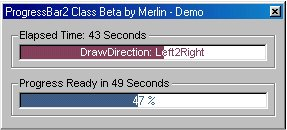



## ProgressBar2Class \(8 DrawDirections, XOR Caption,Time2End Display\)

### Description

This ProgressBar Class can draw in 8 Direction, has XOR Caption(like InstallChield) and a Real Time2End Display. The Performance is very good paint only by Change. If you like it please rate for me.
 
### More Info
 

             |
---                |---
**Submitted On**   |2001-05-25 18:26:18
**By**             |[\_\_merlin\_\_](https://github.com/Planet-Source-Code/PSCIndex/blob/master/ByAuthor/merlin.md)
**Level**          |Beginner
**User Rating**    |5.0 (10 globes from 2 users)
**Compatibility**  |VB 5\.0, VB 6\.0
**Category**       |[Custom Controls/ Forms/  Menus](https://github.com/Planet-Source-Code/PSCIndex/blob/master/ByCategory/custom-controls-forms-menus__1-4.md)
**World**          |[Visual Basic](https://github.com/Planet-Source-Code/PSCIndex/blob/master/ByWorld/visual-basic.md)
**Archive File**   |[ProgressBa200635252001\.zip](https://github.com/Planet-Source-Code/merlin-progressbar2class-8-drawdirections-xor-caption-time2end-display__1-23431/archive/master.zip)

